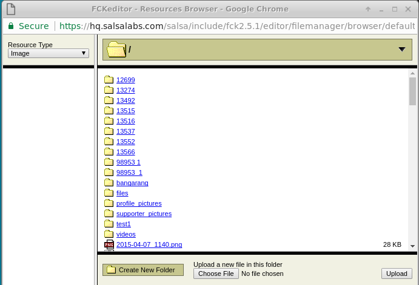
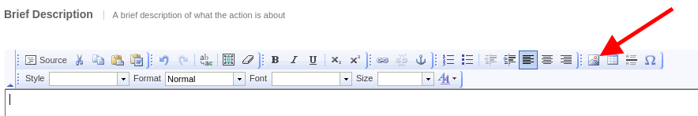
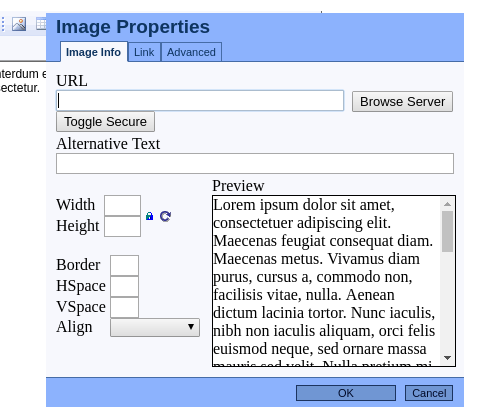

# Better Template Extractor for Salsalabs

Extractenator 9000 is a program that accepts a URL from a website and creates a 
Salsa template.  Salsa templates can be thought of as picture frames that surround
each Salsa page.  Templates provide the look-and-feel of a website so that 
 Salsa pages look the same as your website.

## Table of Contents

- <a href="#background">Background</a>
- <a href="#legalities">Legalities</a>
- <a href="#summary">Summary</a>
- <a href="#installation">Installation</a>
- <a href="#make_it_go">Make it go!</a>
- <a href="#delivery">Delivery</a>
- <a href="#troubleshooting">Troubleshooting</a>
- <a href="#questions">Questions?</a>

<a name="background"></a>
## Background

### Templates must be "secure"

Salsa's templates are used for donation pages, and must be secure.  "Secure" in
this case means that there is a locked padlock in the browser when a supporter or
donor goes to any of your Salsa pages.

Technically a "secure" template (and the pages that use it) are served up by 
Salsa using the secure HTTPS protocol.  Browsers know that a page is secure, and
will block any content that comes from a site with `http://` in the URL.

### Copying resources to Salsa

Since getting HTTPS set up on a website can be complex and prohibitively expensive,
Salsa provides a way to host the files and resources uses by your template.  The
end result is that both the template and all of the resources that it uses are
served up to browsers using HTTPS.  Doing this saves money for our customers and
makes sure that pages like donation pages are secure when they are used.

Copying resources form your website to Salsa is the most important thing that
the Extractenator does.  Quite frankly, it's trivially easy to copy a website from 
one place to another.  The challenge is getting all of the files and making sure
that all of the interdependencies are resolved.

For example, Cascading Style Sheet (CSS) files have a `url` declaration.  This
declaration is used to specify the exact location of a particular resource.  If
the `url` declaration is not changed, then the resource will still be retrieved
from your website after the template is extracted.  That resource will more than
likely not be secure.  The browser will block it and your donor won't have the
locked padlock that they want to see.

## Why "better template extractor?"

At this writing, the Salsa template extractor is an ancient thing thing does not 
always extract pages correctly.  This causes both Salsa and its clients tons of 
aggravation, irritation and additional cost, and I, for one, got fed up with that.

Extractenator duplcates the existing extractor's capabilities. The template and
all of the files referenced by the template are downloaded to Salsa.  The template
is modified to correctly reference the downloaded files.

In addition, Extractenator successfully extracts files that Salsa's extractor
simply cannot handle.  Extractenator does the right thing with URLs requested from
websites, thus avoiding the `403` and `500` errors that plagues clients using the Salsa
extractor.

Extractentator also searches
all resource files for other resources and makes sure that those are retrieved as well.
Gone are the days when a client or specialist had to edit a CSS file to make a font
or background image appear.

This is definite upside for Salsa's clients.  Salsa's clients are outstanding at
their jobs, but generally are not familiar with the internals of CSS.  Extractenator
acknowledges that and does the right thing so that they don't have to be CSS gurus
to use Salsa.

The resulting templates are both clean and secure.  Resource
files required by the templates are stored in the same way that Salsa stores the
files retrieved during a "template download".  Neither the client nor experienced
Salsa support specialists will be able to tell the difference between a template 
extracted by the Salsa extractor and one extracted by Extractenator.  (Okay, except
the one created by Extractenator works correctly the first time it's used.)

My hope is that this free-and-open version template extractor will reduce headaches
and cost for all of us and leave us a bit more time for drinking really good coffee!

<a name="legalities"></a>
## Legalities (really short)

Licensing terms and conditions may be found in the file `LICENSE` in the same
directory as this file. **Do not** contact Salsalabs Support about this package.
You will be sorely disappointed and they will be pissed off.

<a name="got_a_problem"></a>
## Got a problem?
[Click here](https://github.com/salsalabs/extractenator/issues "Click here
to report any problems with the Extractenator") to report problems,
make suggestions, offer funding or pass along a good joke.  Griping, whining
and error reports that don't provide concrete examples may be deleted without
being read.  Just sayin'...

<a name="summary"></a>
## Summary

This package contains a program that

* Reads a JSON configuration file that describes the extraction session.
* Reads the cotnents of an HTML page.
* Reads the pages resource files (CSS, script image) and stores them locally.
* Modifies the template to reference the resource files as relative files in a Salsa image browser.
* Modifies CSS files to reference resources as relative files in a Salsa image browser.
* Replaces a specified HTML element with Salsa's template tags.
* Saves the template to disk.

When the program is done
* The template references files in a Salsa image browser structure.
* CSS files references files in a Salsa image browser structure.
* The files and their directories need to be transferred to Salsa's image repository. (Manual, but not that ugly.)

### Still to do...

* Automatically create a template on Salsa.
* Automatically upload files to the image repository.

<a name="installation"></a>
## Installation

### Prerequisites
Installing Extractenator 9000 requires these software packages.

1. [Node.js](http://nodejs.org/ "Node.js's Homepage")
2. [LiveScript](http://livescript.net/ "LiveScript's Homepage")
3. [Git](http://git-scm.com/ "Homepage for the Git source control program")

A really, really easy way to install Node and LiveScript is to start with the [Node Versio manager (nvm)](https://github.com/creationix/nvm).  Use the installation steps to install `nvm` in your Linux/OSX home dir.  When you log back in again, then you can use these commands to install the correct version of node and LiveScript:

```bash
nvm install 6
nvm use 6
npm install -g livescript
```
The commands install the latest 6.x.x version of `node`, then the latest version of `LiveScript`.

### Setup
* Clone the [Extractenator repository](https://github.com/salsalabs/extractenator)
```bash
cd YOUR_WORKSPACE_DIRECTORY
git clone https://github.com/salsalabs/extractenator.git
```
* Update the environment by installing the node packages used by Extractenator 9000.

```bash
cd extractenator
npm run build
```
* Ignore any warnings.
* [Report errors here.](https://github.com/salsalabs/extractenator/issues
"Click here to report any problems with the Extractenator")

That's it!  Extractenator is ready to use!

<a name="make_it_go"></a>
# Make it go!

## Create a template
The first step to extracting a template is to create a new template in Salsa HQ.  The best way to do that is to create a blank template, then download it.

* [Click here](https://help.salsalabs.com/hc/en-us/articles/115000039353-Create-a-blank-empty-template) to learn how to create a blank template.

* [Click here](https://help.salsalabs.com/hc/en-us/articles/223342307-Web-Templates) to read about web templates.  Search for "Download" to get to the relevant pieces.

Downloading a template creates a directory in the image browser.  The directory name is the `template_KEY` for the template.  For best results, retrieve the `template_KEY` after the download.  We'll use it in the next step.

### Configuration
An Extractenator 9000 session reads from a web page and creates a directory structure that can be copied (maually) to Salsa.  Each session requires `spec.json` file.  `spec.json` is a JSON-formatted file the specifies what needs to be copied and where it needs to go.

The first step after installation is to copy the `spec.json` template to create a new `spec.json`.

```bash
cd YOUR_WORKSPACE_DIRECTORY/extractenator
cp spec-temmplate.json spec.json
```
Here's a sample of a new spec.json file:

```JSON
{
    "name": "just-a-name",
    "uri": "read-this-to-create-template",
    "filename": null,
    "organization-key": a-number,
    "chapter-key": null,
    "template-key":  a-number,
    "tag-selector": "#css-selector-to-element-that-will-surround-templates"
}
```

### Configuration file details
the `spec.json` file contains a list of fields that guide Extractenator 9000.  This section descripbes each field in detail.

### A note on `spec.json`'s file format

JSON files have a very specific format.  All of the punctation in the `spec.json` file is required and should not be modified.  Field names are on the left, values are on the right.  Field names should not be modified.  Numeric values do not have quotation marks.  Neither does the word `null`.  All other values must have quotation marks.


| Field            | Value  |
| ---------------- |--- |
| name             | Just a name.  Use something short.|
| uri              | The URL of the page to use to create the template.  If the site has a very fancy first page, then find a page that only has text on it. "Who we are" and staff pages are best. |
| filename         | (Optional).  If the contents of the URL are  just impossible to use, then the `filename` field contains a file on disk to use instead of a URL on the web.  If `filename` appears, then Extractenator 9000 ignores the `uri` parameter.  This is a last-ditch thing to do.  You should _not_ use the filename unless there's a bunch of money involved and the website is impossible. For example, big dollars that make the regrettable Wix decision. |
| organization-key | The client's organization KEY |
| chapter-key      | (Optional) the client's chapter key.  If supplied, then Extractenator 9000 will add the `chapter-key` to the directory structure where files are stored.  That's a Salsa-required thing. |
| template-key     | The value of `template_KEY` for the template prepared in the next step. The prep process takes care of creating the necessary directories in the client's image directory. |
| tag-selector     | The CSS selector for the part of the web page that will be replaced by Salsa content.  See the description below.|

### Retrieving the CSS slector.

Extractenator needs a CSS selector to know which HTML element on the page will contain Salsa content.  Here are some steps that you can use to retrieve that selector.

1. Open the site's URL with Chrome.  (Yes, Chrome.  Firefox won't do...)
2. Search the site for the HTML element that will contain Salsa content.  Find the one that has the right margins and that you can imagine Salsa pages appearing in.
3. Inspect the selected element.  A lot of the page will be light blue when you do that.
4. Right-click on the selected element in the "Element" view of the browser tools.
5. Choose "Copy Selector".
6. Paste the copied selector into the value field for the `tag-selector` field.  Make sure that it's surrounded with quotation marks (_not_ apostrophes!)|

### Verify `spec.json`.
Use this command to verify that `spec.json` is formatted correctly.

```bash
node spec.json
```

If nothing appears after the command, then the file is ready to use.  If you see any messages, then decode them and fix the file.  Continue to use node to check the file until there are no messages.

<a name="execution"></a>
## Execution

Running the application is straightforward.  Open a terminal and type these commands.

```bash
cd YOUR_WORKSPACE_DIRECTORY/extractenator
node lib/app
```
When execution is done, resource files (`HTML`, `CSS`, images, scripts, etc.) will have been copied, modified as needed, and stored onto your disk drive.

<a name="delivery"></a>
## Delivery

Extractenator 9000 stores the modified template and all of the files in a local directory ("./o").  The directory structure exactly matches the structure uses by Salsa's own template extractor.  

Delivery involves using a Salsa image browser window to copy files from "./o" to several folkders in the image browsser.  When that's done correctly,  all references to resource files (CSS, scripts, images, fonts) will work correctly.

### Background (do not skip this part, K?)
Extractenator 900 stores resources for a template in a directory that contains

* organization_KEY
* (optional) chapter_KEY
* template_KEY

Specifically, Extractenator 9000 stores resources on disk in a directory structure that matches the Salsa-standard relative URL for uploaded images and files.  

`/o/[[organization_KEY]]/[[images]]/[[template_KEY]]`

The directory structure changes a bit if images and files are storef for a chapter.

`/o/[[organization_KEY]]/c/[[chapter_KEY]]/[[images]]/[[template_KEY]]`

In both cases, the extracted files will go into the `[[template_KEY]]` directory.  The template keys are always numeric and always appear at the top of the list of directories in the image viewer.



# Delivering files to Salsa
Delivery is currently an intensely manual process.  You will use the Salsa image browser to move all of the files one at a time.  

Here are some steps that you can use.

1. Login to Salsa HQ as the client.
2. Navigate to any page that uses the What You See Is What You Get (WYSIWYG) editor.
3. Choose the "image" tool from the editor's tool bar.

4. The image tool dialog will appear.

5. Click the `Browse Server` button.
6. The image directory will appear.

7. Click on the folder for the `template-key` in `spec.json`.
8. Use the `Create New Folder` button to create these directories:
    * `css`
    * `font`
    * `image`
    * `script`

9. Once the directories are created, then use these steps for each directory.
    1. Click to open the directory.
    2. Manually copy all of the files from the same directory on disk.  For example, click in the `css` folder, then copy files from `./o/[[organization_KEY]]/[[images]]/[[template_KEY]]/css` into it.
    3. Verify that all of the files are moved.
10. Test the template.

<a name="troubleshooting"></a>
## Troubleshooting

Start by reading the doc about [managing images and files](https://help.salsalabs.com/hc/en-us/articles/223342727-Managing-files-uploaded-to-Salsa).  This is not an optional step, so just click it and read.  

### Template is missing a font or image.

1. Copy the missing file from the client's website.
2. Use the image browser to upload the file to Salsa.  To keep this consistent, you should put the missing file in the correct directory on Salsa (`css`, `font`, `image`, `script`, etc.).
3. Edit the template to update the image (font, etc) URL.  Replace the URL with the Salsa relative URL.  For example, 

`2. Use the image browser to upload the file to Salsa.  To keep this consistent, you should put the missing file in the correct directory on Salsa (`css`, `font`, `image`, `script`, etc.).`

### CSS file is missing a font or image.

1. Copy the missing file from the client's website.
2. Use the image browser to upload the file to Salsa. 
3. Find the CSS file on your disk.  For example

`./o/123456/images/5432/css/fontawesome.css`

4. Copy the file and rename the copy to have "-1" in the name (or -2 or -3 depending on how successful you are).

`./o/123456/images/5432/css/fontawesome-1.css`

5. Edit the new CSS file to update the image (font, etc) URL.  Replace the URL with the Salsa relative URL.  For example, 

``

6. If there are a bunch of fonts involved, then you really should copy them all and edit the file with all of the font filenames so that you don't have to repeat this process.

7. Save the modified CSS file.
8. Use the image browser to upload the file to Salsa.  To keep this consistent, you should put the missing file in the `css` directory.
9. Edit the new template.
10. Replace the CSS URL with the URL for the new file.  For example, change

`<link href="/o/123456/images/5432/css/fontawesome.css" />`

to

`<link href="/o/123456/images/5432/css/fontawesome-1.css" />`

11. Save the template.
12. Test!

<a name="questions"></a>
## Questions?

If you work for Salsa, then you can contact the author directly.  He's gonna be right there in the room.  If you do not work for Salsa, then [click here](#)